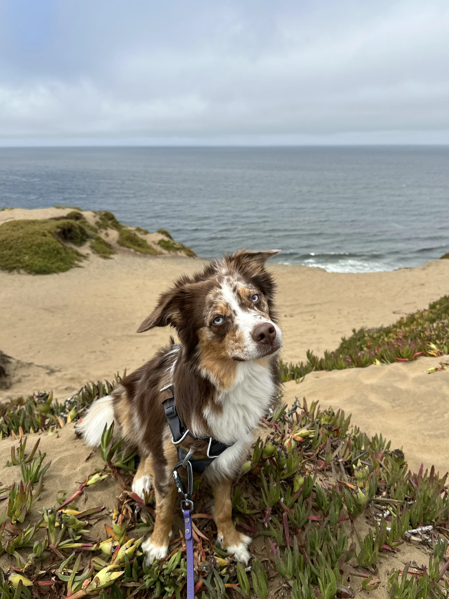
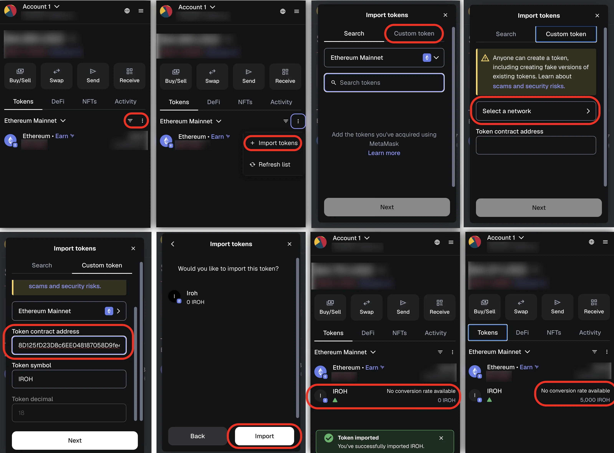

Iroh Coin (IROH), is a memecoin for Iroh, our Australian Shepherd.



## How to Acquire

You may trade for it from other coin holders, but that is **not** recommended!

Iroh will give you some coins if he likes you. Bribery goes a long way with him. He like treats, belly rubs, and playing in the park.

Give him your [Ethereum wallet address](#instructions) and he may give you some coin.

## Contract

IROH is an ERC20 contract on the Ethereum blockchain.

## Contract Address

```txt
0x0fCEa0D43d8D125fD23D8c6EE048187058D9fe48
```

View it on the [Block Explorer](https://etherscan.io/address/0x0fCEa0D43d8D125fD23D8c6EE048187058D9fe48).

## Instructions

The following instructions assume you are using the [Metamask wallet](https://metamask.io/). Other wallets should have similar instructions.

1. Install the [Metamask Browser Extension](https://metamask.io/download).
* Create or import an existing Ethereum wallet.
* In the Tokens tab, click the dropdown button on the top-right corner.
* Click `+ Import tokens`.
* Go to the `Custom token` tab.
* For the `Select a network` option, select `Ethereum Mainnet`.
* For the `Token contract address`, copy and paste the [contract address](#contract-address).
* Click `Import` and see the confirmation.
* Once you get IROH tokens, your balance should automatically update.


